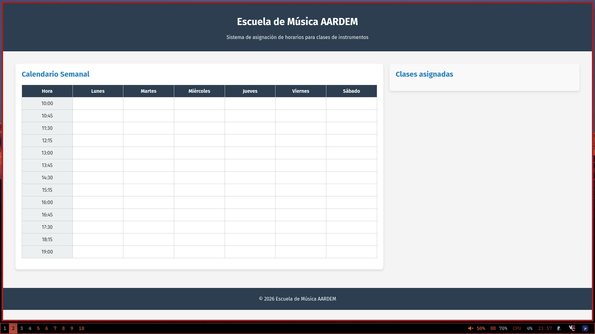
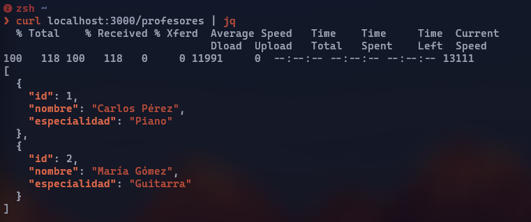

# 🎵 Sistema de Gestión - Escuela de Música AARDEM

Bienvenido al repositorio oficial del proyecto **AARDEM**, una solución integral para la gestión de horarios, alumnos y clases, construida con tecnologías modernas de desarrollo web.

---

## 🚀 Tecnologías Utilizadas

### **Frontend**

* **Vue.js 3 (Composition API):** Para una interfaz reactiva y moderna.
* **Vite:** Bundler de última generación para un desarrollo ultra rápido.
* **CSS Moderno:** Diseño modular y componentes escalables.

### **Backend**

* **Node.js & Express.js:** Servidor robusto para el manejo de la API REST.
* **CORS:** Configurado para comunicación segura entre dominios.
* **PostgreSQL:** Base de datos relacional para la persistencia de datos complejos.

---

## 🛠️ Arquitectura del Sistema

### 🎨 Frontend (Interfaz de Usuario)

Se implementó una estructura de componentes modulares donde destaca `Calendar.vue`. Este componente gestiona la lógica de la agenda semanal.

* **Funcionalidad:** Visualización de horarios (08:00 a 21:00), asignación de clases mediante interacción directa y paneles laterales para gestión de catálogo.
* **Estado:** Reactividad optimizada con la sintaxis `<script setup>`.

### ⚙️ Backend (Servidor API)

El corazón del sistema corre sobre **Express**, gestionando las rutas y la lógica de negocio.

* **Endpoints:** Rutas preparadas para el manejo de usuarios, profesores, alumnos y horarios.
* **Seguridad:** Implementación de middlewares para validación y control de acceso.

### 📊 Base de Datos (PostgreSQL)

Diseño de base de datos relacional llamada `escuela_alumnos` que incluye:

* **Gestión de Roles:** Diferenciación entre Admin, Profesores y Alumnos.
* **Control de Solapamientos:** Restricciones lógicas para evitar que un profesor o aula tenga dos clases al mismo tiempo.
* **Esquema:** Tablas de login, correos electrónicos, cursos y descripciones detalladas.

---

## 🧩 1. Requisitos Previos

Para garantizar la estabilidad, este proyecto utiliza **Nix**.

* **Nix** con flakes habilitados.
* **Git**.

*Nota: Nix provee Node.js y Postgres automáticamente. Si no usas Nix, deberás instalarlos manualmente en tu sistema.*

---

## 📥 2. Instalación y Configuración

### Clonar el repositorio

```bash
git clone https://github.com/zekar47/dfs-proyecto
cd dfs-proyecto

```

### Entrar al entorno de desarrollo

Esto configurará automáticamente Node, Postgres y pnpm.

```bash
nix develop

```

---

## 🗄️ 3. Configuración de Base de Datos

El proyecto incluye scripts automatizados para facilitar la configuración inicial.

1. **Iniciar la DB local:**
```bash
db-start

```


*(Crea el usuario `app_user`, la DB `escuela_musica` y arranca el servidor Postgres).*
2. **Cargar tablas y semillas (Seed):**
```bash
db-seed

```


*(Ejecuta el SQL con la estructura de tablas y datos de prueba).*

---

## 🔌 4. Puesta en marcha del Servidor (Backend)

1. Navega a la carpeta y levanta el servicio:

```bash
cd backend
pnpm install
pnpm dev

```

2. **Verificación:** Deberías ver `🚀 API running on http://localhost:3000`.
Puedes probarlo con: `curl http://localhost:3000`

---

## 💻 5. Puesta en marcha del Cliente (Frontend)

En una **nueva terminal**:

1. Instala y corre el servidor de desarrollo:

```bash
cd frontend
pnpm install
pnpm dev

```

2. Abre tu navegador en: `http://localhost:5173`

---

## 📸 Galería del Proyecto

Aquí se muestran las capturas de pantalla de los diferentes módulos del sistema:

| Interfaz de Calendario | Respuesta del API |
| --- | --- |
| |  |


